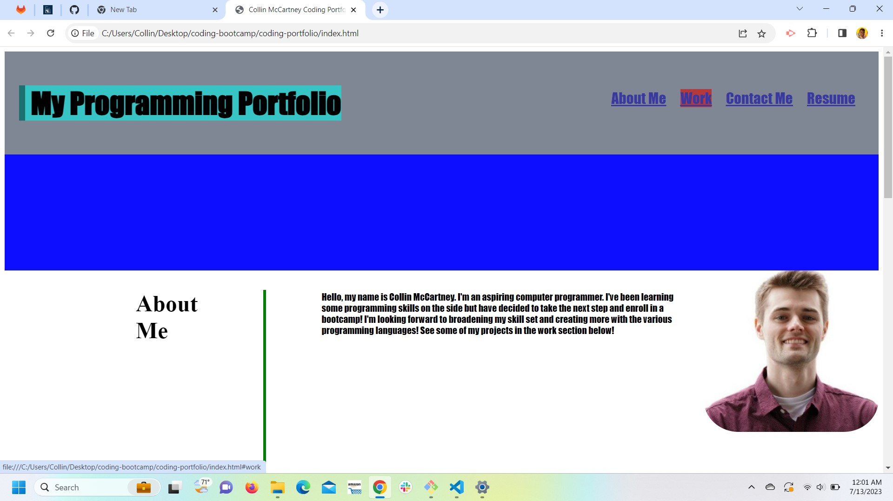

# My Portfolio

## Description

This challenge gave bootcamp students the opportunity to create their own portfolio page. Even though the project page is empty and sample photos are used, we will add to that section as we move along in this course. 

## Installation 

N/A

## Usage

You are able to scroll up and down on this portfolio page to view the contents. You are also able to click on the navigation links above and they will automatically scroll to the desginated sections. Please see the attached screenshot which shows the navigation capabilites. The cursor is hovered over the Work navigation link. 

## Credits 

Free commercial use stock photos came from pixabay.com

## License

N/A